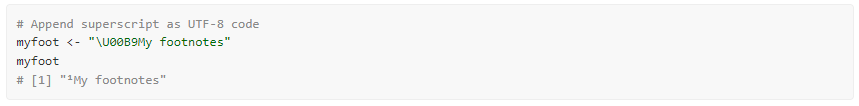
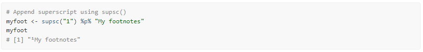
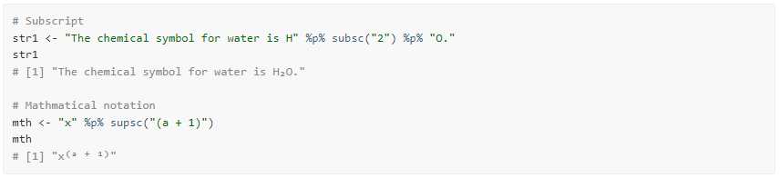
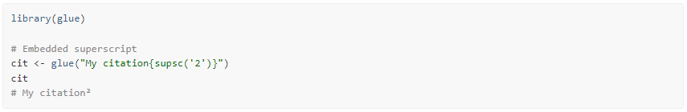
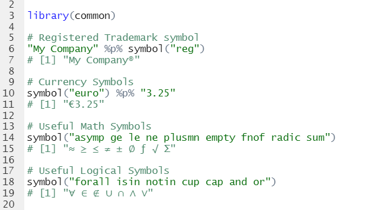
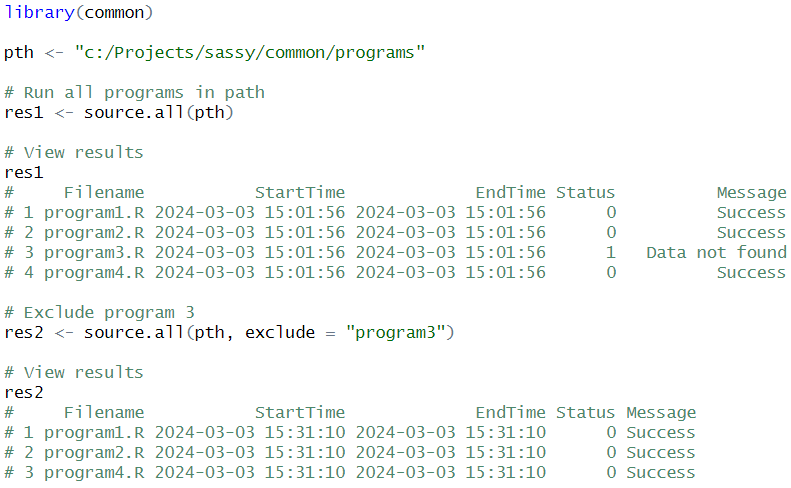

```{r, include = FALSE}
knitr::opts_chunk$set(
  collapse = TRUE,
  comment = "#>"
)
```
The **common** package is a lightweight package that contains 
solutions for commonly encountered problems when working in Base R. 

Here is a list of the functions and a short explanation of each:

- [**v()**](#v): A generalized NSE quoting function.
- [**sort.data.frame()**](#sort): An overload to the sort function for data frames. 
- [**labels.data.frame()**](#labels): An overload to the labels function for data frames.
- [**%p%**](#p): An infix operator for the `paste0()` function.
- [**%eq%**](#eq): An enhanced equality operator.
- [**Sys.path()**](#path): A function to return the path of the currently running program.
- [**roundup()**](#roundup): A rounding function that matches SAS® rounding.
- [**file.find()**](#find): A function to search for a file on the file system.
- [**dir.find()**](#find): A function to search for a directory on the file system.
- [**find.names()**](#names): A function to search for variable names on a data.frame.
- [**copy.attributes()**](#attr): A function to copy column attributes from
one data frame to another.
- [**supsc()**](#supsc): A function to get UTF-8 superscript characters.
- [**subsc()**](#supsc): A function to get UTF-8 subscript characters.
- [**symbol()**](#symbol): A function to lookup UTF-8 symbols.
- [**spaces()**](#spaces): A function to create a string of blank spaces.
- [**changed()**](#changed): A function to identify changed values in a vector or data frame.
- [**source.all()**](#sourceall): A function to source an entire directory of R programs.


## A generalized NSE quoting function {#v}
Normally, when working in Base R, it is necessary to quote variable names
when passing them into a function or operator.  For example, observe
the R subset brackets:
```{r eval=FALSE, echo=TRUE}
# Variable names passed to subset are quoted
dat <- mtcars[1:10 , c("mpg", "cyl", "disp")]

# View results
dat
                   mpg cyl  disp
Mazda RX4         21.0   6 160.0
Mazda RX4 Wag     21.0   6 160.0
Datsun 710        22.8   4 108.0
Hornet 4 Drive    21.4   6 258.0
Hornet Sportabout 18.7   8 360.0
Valiant           18.1   6 225.0
Duster 360        14.3   8 360.0
Merc 240D         24.4   4 146.7
Merc 230          22.8   4 140.8
Merc 280          19.2   6 167.6
```

Some Base R functions and almost all **tidyverse** functions 
use Non-standard Evaluation (NSE) when passing variable
names.  This style of evaluation allows the user to type
variables without using quotation marks or other methods of resolution. 

Picking up from the previous example, let's now subset the `dat` data frame
created above using the `subset()` function, which uses NSE:
```{r eval=FALSE, echo=TRUE}
# No quotes on "cyl" using subset() function
dt <- subset(dat, cyl == 4)

# View results
dt
#             mpg cyl  disp
# Datsun 710 22.8   4 108.0
# Merc 240D  24.4   4 146.7
# Merc 230   22.8   4 140.8
```
The `v()` function in the **common** package is a quoting function.  It allows
you to use Non-Standard Evaluation (NSE) even on functions that were not
specifically written for NSE. Observe:
```{r eval=FALSE, echo=TRUE}
# Create a vector of unquoted names
v1 <- v(mpg, cyl, disp)

# Result is a quoted vector
v1
# [1] "mpg"  "cyl"  "disp"

# Variable names not quoted
dat2 <- mtcars[1:10, v(mpg, cyl, disp)]

# Works as expected
dat2
#                    mpg cyl  disp
# Mazda RX4         21.0   6 160.0
# Mazda RX4 Wag     21.0   6 160.0
# Datsun 710        22.8   4 108.0
# Hornet 4 Drive    21.4   6 258.0
# Hornet Sportabout 18.7   8 360.0
# Valiant           18.1   6 225.0
# Duster 360        14.3   8 360.0
# Merc 240D         24.4   4 146.7
# Merc 230          22.8   4 140.8
# Merc 280          19.2   6 167.6

```
[top](#top)

## Sort a data frame {#sort}
Base R provides sort and order functions that work adequately on vectors. 
For data frames, the options are more limited.  In particular, if you want to sort
a data frame by multiple columns, there are no functions in Base R to do it.
The R documentation makes the following suggestion:
```{r eval=FALSE, echo=TRUE}
# Prepare data
dat <- mtcars[1:10, 1:3]

# Get sort order
ord <- do.call('order', dat[ ,c("cyl", "mpg")])

# Sort data
dat[ord, ]
#                    mpg cyl  disp
# Datsun 710        22.8   4 108.0
# Merc 230          22.8   4 140.8
# Merc 240D         24.4   4 146.7
# Valiant           18.1   6 225.0
# Merc 280          19.2   6 167.6
# Mazda RX4         21.0   6 160.0
# Mazda RX4 Wag     21.0   6 160.0
# Hornet 4 Drive    21.4   6 258.0
# Duster 360        14.3   8 360.0
# Hornet Sportabout 18.7   8 360.0
```
In the above example, notice that a) there is no actual sorting function for
data frames, and b) the method illustrated above provides no way to 
control the sort order of the variables involved.  They are all sorted 
ascending.

The `sort.data.frame()` function is an overload to the generic `sort()` function
that is tailored for data frames.  It allows you to sort by multiple columns,
and control the sort direction for each sort variable.  Here is an example:

```{r eval=FALSE, echo=TRUE}
# Sort by cyl then mpg
dat1 <- sort(dat, by = v(cyl, mpg))
dat1
#                    mpg cyl  disp
# Datsun 710        22.8   4 108.0
# Merc 230          22.8   4 140.8
# Merc 240D         24.4   4 146.7
# Valiant           18.1   6 225.0
# Merc 280          19.2   6 167.6
# Mazda RX4         21.0   6 160.0
# Mazda RX4 Wag     21.0   6 160.0
# Hornet 4 Drive    21.4   6 258.0
# Duster 360        14.3   8 360.0
# Hornet Sportabout 18.7   8 360.0

# Sort by cyl descending then mpg ascending
dat2 <- sort(dat, by = v(cyl, mpg),
             ascending = c(FALSE, TRUE))
dat2
#                    mpg cyl  disp
# Duster 360        14.3   8 360.0
# Hornet Sportabout 18.7   8 360.0
# Valiant           18.1   6 225.0
# Merc 280          19.2   6 167.6
# Mazda RX4         21.0   6 160.0
# Mazda RX4 Wag     21.0   6 160.0
# Hornet 4 Drive    21.4   6 258.0
# Datsun 710        22.8   4 108.0
# Merc 230          22.8   4 140.8
# Merc 240D         24.4   4 146.7

```
The `sort.data.frame()` function also allows you to control whether NA
values are sorted to the top or bottom.  See the documentation for further 
information and more examples.   

NOTE: As of R version 4.4, released Spring of 2024, there is a new function
to sort by multiple columns in Base R: 
[sort_by()](https://search.r-project.org/CRAN/refmans/lessR/html/sort_by.html).  
The `sort.data.frame()` function from the **common** package will remain 
for backward compatibility reasons.  Going forward, it is probably better 
to use the Base R function if it is available.

[top](#top)

## Modify labels on a data frame {#labels}
While many data operations in R do not require control over the labels
on a data frame, some types of programming do. Particularly in situations
where you are sharing data between multiple people and groups, the column
labels can provide valuable information about the data contained in a particular
column.  

Unfortunately, Base R does not supply an easy way to manipulate these
labels. The only approach is to use the `attr()` function to set the 
labels individually for each column.  Like this:
```{r eval=FALSE, echo=TRUE}
# Prepare data
dat <- mtcars[1:10, 1:3]

# Assign labels
attr(dat$mpg, "label") <- "Miles Per Gallon"
attr(dat$cyl, "label") <- "Cylinders"
attr(dat$disp, "label") <- "Displacement"

```
The `labels.data.frame()` function is an overload to the Base R 
`labels()` function that is specific to data frames.  The function
allows you to set labels for an entire data frame using a named list.
Here is an example:
```{r eval=FALSE, echo=TRUE}
# Prepare data
dat <- mtcars[1:10, 1:3]

# Assign labels
labels(dat) <- list(mpg = "Miles Per Gallon",
                    cyl = "Cylinders",
                    disp = "Displacement")
                    
# View label attributes
labels(dat)
# $mpg
# [1] "Miles Per Gallon"
# 
# $cyl
# [1] "Cylinders"
# 
# $disp
# [1] "Displacement"
```
This function makes it much easier to set and retrieve labels on a data
frame.  The labels make it easier for users to understand the data.
This function should be included in Base R, but for some reason is not.   
[top](#top)

## An infix concatenation operator {#p}
Most programming languages provide a built-in concatenation operator.  R does
not. Instead, it provides the `paste()` and `paste0()` functions.  While 
these functions do perform concatenation adequately, it is sometimes more convenient
to have an operator.  

The `%p%` operator is an infix version of the `paste0()` function.  It provides
the same functionality of `paste0()`, but in a more compact manner. Like so:
```{r eval=FALSE, echo=TRUE}
# Concatenation using paste0() function
paste0("There are ", nrow(mtcars), " rows in the mtcars data frame")
# [1] "There are 32 rows in the mtcars data frame"

# Concatenation using %p% operator
"There are " %p% nrow(mtcars) %p% " rows in the mtcars data frame"
# [1] "There are 32 rows in the mtcars data frame"

```
[top](#top)

## An enhanced equality operator {#eq}
The **common** package contains an enhanced equality operator.  The 
objective of the `%eq%` operator is to return a TRUE or FALSE value when
any two objects are compared.  This enhanced equality operator is useful
for situations when you don't want to check for NULL or NA values, or care
about the data types of the objects you are comparing.

The `%eq%` operator also compares data frames.  The comparison will include
all data values, but no attributes.  This functionality is particularly useful
when comparing tibbles, as tibbles often have many attributes assigned by 
`dplyr` functions.

Below is an example of several comparisons using the `%eq%` infix operator:

```{r eval=FALSE, echo=TRUE}

# Comparing of NULLs and NA
NULL %eq% NULL        # TRUE
NULL %eq% NA          # FALSE
NA %eq% NA            # TRUE
1 %eq% NULL           # FALSE
1 %eq% NA             # FALSE

# Comparing of atomic values
1 %eq% 1              # TRUE
"one" %eq% "one"      # TRUE
1 %eq% "one"          # FALSE
1 %eq% Sys.Date()     # FALSE

# Comparing of vectors
v1 <- c("A", "B", "C")
v2 <- c("A", "B", "C", "D")
v1 %eq% v1            # TRUE
v1 %eq% v2            # FALSE

# Comparing of data frames
mtcars %eq% mtcars    # TRUE
mtcars %eq% iris      # FALSE
iris %eq% iris[1:50,] # FALSE

# Mixing it up 
mtcars %eq% NULL      # FALSE
v1 %eq% NA            # FALSE
1 %eq% v1             # FALSE
```
In addition to the `%eq%` operator, the **common** package includes  
mnemonic infix operators for `%ne%`, `%lt%`, `%gt%`, `%le%`, and `%ge%`.  All 
of these operators perform the appropriate comparison and handle NA and NULL values.
For examples and explanation, consult the documentation for each of the operators.

While it can be advantageous to have comparison operators that do not give
errors when encountering a NULL or NA value, note that this behavior can also 
mask problems with your code.  Therefore, use the comparison operators
with care.   
[top](#top)

## Getting the current path {#path}
Most programming languages provide a simple way to get the path of the
currently running program. This basic feature has been left out of R.  The 
`Sys.path()` function aims to make up for the oversight.

```{r eval=FALSE, echo=TRUE}
# Get current path
pth <- Sys.path()

# View path
pth
# [1] "C:/packages/common/vignettes/common.Rmd"
```
Note that this function returns the full path of the currently running
program, including the file name and extension.  This functionality is different from
`getwd()`, which returns only the current working directory.  

[top](#top)

## An alternate rounding function {#roundup}
As everyone knows, the R `round()` function rounds to the nearest even.
For example: 
```{r eval=FALSE, echo=TRUE}
# Prepare sample vector 
v1 <- seq(0.5,9.5,by=1)
v1
# [1] 0.5 1.5 2.5 3.5 4.5 5.5 6.5 7.5 8.5 9.5

# Base R round function
r1 <- round(v1)

# Rounds to nearest even
r1
# [1]  0  2  2  4  4  6  6  8  8 10

```
However, humans and other software systems usually round 5 up.  The reasons for
R rounding the way it does are valid.  Yet this difference
in the way R rounds sometimes makes it difficult to compare R results
to results from other software systems, particularly SAS®. It would be 
convenient if there were another rounding function that could be used 
when trying to compare R results to SAS®.  

That is the purpose of the `roundup()`
function. Observe the differences in output to what was shown above:
```{r eval=FALSE, echo=TRUE}
# Round up function
r2 <- roundup(v1)

# Rounds 5 up
r2
# [1]  1  2  3  4  5  6  7  8  9 10

```
Note that the function behaves differently when rounding negative 
values.  
```{r eval=FALSE, echo=TRUE}
# Negate original vector
v2 <- -v1
v2
# [1] -0.5 -1.5 -2.5 -3.5 -4.5 -5.5 -6.5 -7.5 -8.5 -9.5

# Rounding negative values
r3 <- roundup(v2)

# Rounds away from zero
r3
# [1]  -1  -2  -3  -4  -5  -6  -7  -8  -9 -10
```
As you can see, when dealing with negative numbers, the `roundup()`
function actually rounds down.  "Round away from zero" is the best description
of this function.  The rounding logic of the `roundup()` function 
matches SAS® software, and can be used when comparing output between
the two systems.   
[top](#top)


## File and Directory search {#find}
Sometimes you know the name of the file you are looking for, but 
do not know the exact location.  It might be in the directory above your
program, or it might be in the directory below.  It could be one level up,
or 3 levels up.  

The `file.find()`
function provides an easy way to search for files you are looking for.
You tell the function where to start searching from and what to look for,
and it will begin looking in the base directory.  Once the base directory 
is searched, it will expand the search above and below the 
base directory.  The search routine will continue expanding the search
until it hits the 
limits imposed by the `up` and `down` parameters.  Here is an example:
```{r eval=FALSE, echo=TRUE}
# Look for a file named "globals.R"
pths <- file.find(getwd(), "globals.R")
pths

# Look for Rdata files three levels up, and two levels down
pths <- file.find(getwd(), "*.Rdata", up = 3, down = 2)
pths
```
The function will return a vector of full paths that meet the search 
criteria, and are within bounds of the search.  If no file is 
found that meets the search criteria, the function returns a NULL.  

The `dir.find()` function works the same as `file.find()`, but for directories
instead of files.  Note that these two functions may be used together to
perform complex searches.  
[top](#top)


## Finding variable names {#names}
Sometimes you have a data frame with many variables, and you 
need to perform an operation on only some of them.  The `find.names()`
function can help you subset these variable names. There are parameters
to define the search criteria, provide exclusions, and a beginning and ending
range to perform the search. Here are some simple examples:
```{r eval=FALSE, echo=TRUE}
# Prepare data
dat <- mtcars

# View names
names(dat)
# [1] "mpg"  "cyl"  "disp" "hp"   "drat" "wt"   "qsec" "vs"   "am"   "gear" "carb"

# Get all names starting with "c"
find.names(dat, pattern = "c*")
# [1] "cyl"  "carb"

# Get all names starting with "c" or "d"
find.names(dat, pattern = c("c*", "d*"))
# [1] "cyl"  "carb" "disp" "drat"

# Get names starting with "c" or "d" from column 4 on
find.names(dat, pattern = c("c*", "d*"), start = 4)
# [1] "carb" "drat"

```

## Copying attributes between data frames {#attr}
Base R functions that work with data frames are annoying in that they 
often drop any attributes assigned to data frame columns. Observe:
```{r eval=FALSE, echo=TRUE}
# Prepare sample dataset
dat <- mtcars[ , 1:3]

# Assign some labels 
labels(dat) <- list(mpg = "Miles Per Gallon", 
                    cyl = "Cylinders",
                    disp = "Displacement")

# View labels
labels(dat)
# $mpg
# [1] "Miles Per Gallon"
# 
# $cyl
# [1] "Cylinders"
# 
# $disp
# [1] "Displacement"

# Subset the data
dat2 <- subset(dat, cyl == 4)

# Labels are gone!
labels(dat2)
# list()

```
To get the attributes back, one must copy the attributes from the original
data frame to the subset data frame.  That is what the `copy.attributes()`
function does.  Picking up from the example above, let's now restore the 
attributes lost during the `subset()` operation:
```{r eval=FALSE, echo=TRUE}
# Restore attributes
dat2 <- copy.attributes(dat, dat2)

# Labels are back!
labels(dat2)
# $mpg
# [1] "Miles Per Gallon"
# 
# $cyl
# [1] "Cylinders"
# 
# $disp
# [1] "Displacement"

```

## Superscripts and Subscripts {#supsc}
There are many occasions when you need to 
create a superscript or subscript. The UTF-8 character set provides
superscript and subscript versions of many commonly used characters.
For example, the following code can be used to add a superscript '1'
to the front of a footnote string:


Remembering these UTF-8 codes, however, can be a challenge for most people.
The `supsc()` and `subsc()` functions look up the superscript
or subscript version of a normal character, without having to remember
or research the proper UTF-8 code.  

Using these functions, we can therefore rewrite the above example as follows:


Here are a couple more examples:


Note that using the **glue** package, you can embed these functions
directly in your character strings:


[top](#top)


## Special Symbols {#symbol}
The `symbol()` function retrieves symbols frequently used in reports and
documentation.  This function 
is similar to the `supsc()` and `subsc()` functions in
that it looks up a UTF-8 character.  Instead of providing a direct 1 to 1 
translation, however, it looks up the UTF-8 character based on a keyword.

For example, the 'reg' keyword looks up the registered trademark symbol.  The
'ne' keyword looks up the symbol for not equals.  These keyword names
follow HTML conventions.  The function supports keywords for trademarks, 
currencies, mathematical symbols, logical symbols, Greek letters, and 
more.  See the `symbol()` documentation for a complete list 
of supported keywords.  


[top](#top)

## Repeating spaces {#spaces}
It sometimes happens that you need to separate some strings by a certain
number of blank spaces.  This operation is often done in Base R as follows:
```{r eval=FALSE, echo=TRUE}
# Separate two strings by 25 spaces
str <- paste0("Left", paste0(rep(" ", 25), collapse = ""), "Right", collapse = "")
str
# [1] "Left                         Right"

```
However, the above code is rather clumsy. The `spaces()` function 
(plus the `%p%` operator also found in this package) can clean up
this type of task for you significantly.  Observe:
```{r eval=FALSE, echo=TRUE}
# Separate two strings by 25 spaces
str <- "Left" %p% spaces(25) %p% "Right"
str
# [1] "Left                         Right"
```

[top](#top)

## Identify changed values {#changed}
Base R has a `duplicated()` function that is sometimes used to identify grouping boundaries
in a vector.  But this function also performs a `unique()` operation on 
the vector, such that not all boundaries return a TRUE value.
Observe the following:
```{r eval=FALSE, echo=TRUE}
# Create sample vector
v1 <- c(1, 1, 1, 2, 2, 3, 3, 3, 1, 1)

# Identify duplicated values
res1 <- !duplicated(v1)

# View duplicated results
res1
# [1] TRUE FALSE FALSE  TRUE FALSE  TRUE FALSE FALSE FALSE FALSE

```
Notice that the "1" at position nine does not return TRUE.  

Now lets run the same vector through the `changed()` function:
```{r eval=FALSE, echo=TRUE}
# Identify changed values
res2 <- changed(v1)

# View changed results
res2
# [1] TRUE FALSE FALSE  TRUE FALSE  TRUE FALSE FALSE  TRUE FALSE

```
This time, the `changed()` function identified each time the vector changed
value, whether or not the value had appeared previously.  

This function can also be used on data frames:
```{r eval=FALSE, echo=TRUE}
# Create sample data frame
v2 <- c("A", "A", "A", "A", "A", "A", "B", "B", "B", "B")
dat <- data.frame(v1, v2)

# View original data frame
dat
#    v1 v2
# 1   1  A
# 2   1  A
# 3   1  A
# 4   2  A
# 5   2  A
# 6   3  A
# 7   3  B
# 8   3  B
# 9   1  B
# 10  1  B

# Get changed values for each column
res3 <- changed(dat)

# View results
res3
#    v1.changed v2.changed
# 1        TRUE       TRUE
# 2       FALSE      FALSE
# 3       FALSE      FALSE
# 4        TRUE      FALSE
# 5       FALSE      FALSE
# 6        TRUE      FALSE
# 7       FALSE       TRUE
# 8       FALSE      FALSE
# 9        TRUE      FALSE
# 10      FALSE      FALSE
```
If you wish to return a single indicator vector for the combination of 
all columns, use the "simplify" option.
```{r eval=FALSE, echo=TRUE}
# Get changed values for each column
res4 <- changed(dat, simplify = TRUE)

# View results
res4
# [1]  TRUE FALSE FALSE  TRUE FALSE  TRUE  TRUE FALSE  TRUE FALSE
```
The above vector returns a TRUE when either the "v1" or "v2" value 
changes.

The "reverse" option identifies the last items in a group instead of the 
first:
```{r eval=FALSE, echo=TRUE}
# Find last items in each group
res3 <- changed(dat, reverse = TRUE)

# View results
res3
#    v1.changed v2.changed
# 1       FALSE      FALSE
# 2       FALSE      FALSE
# 3        TRUE      FALSE
# 4       FALSE      FALSE
# 5        TRUE      FALSE
# 6       FALSE       TRUE
# 7       FALSE      FALSE
# 8        TRUE      FALSE
# 9       FALSE      FALSE
# 10       TRUE       TRUE

```

[top](#top)

## Source a directory of programs {#sourceall}
Base R has a `source()` function to run a specified program. What if you want
to run an entire directory full of programs? The `source.all()` function
makes it easy!

The function allows you to run many programs at once. 
You can point the function to a directory, and run all the programs in that 
directory.  Conveniently, the function
will return a data frame that shows you the execution status for each program.

The function also has two parameters to help you control which programs get run:
"pattern" and "exclude". The "pattern" parameter allows you to pass a vector
of inclusion criteria.  The "exclusion" parameter does the opposite. Between the
two, you will have very precise control over what gets executed.

The following example will execute four programs in a directory. Notice that
the third program generates an error.  The error message will be passed back
to the result data frame, and the status set to 1.  Also notice that the 
function will continue to execute the remaining programs, even if program 3 
has an error.



See the `source.all()` documentation for additional information and examples.

[top](#top)
